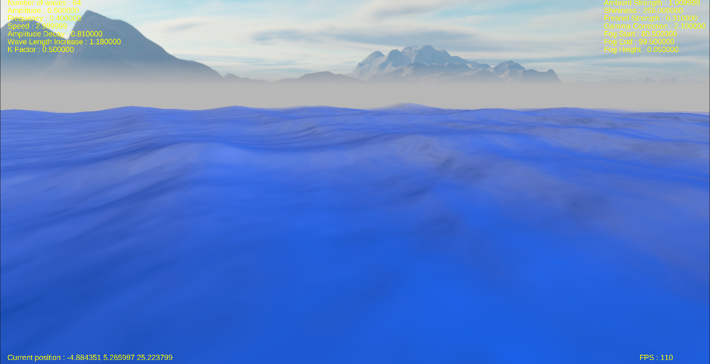

# Ocean
 A simulation of an ocean using a sum of waves with modifiable parameters.
 
## Screenshot
 

# Depedencies
 In order to run the simulation, you need :  
 Support for OpenGL 3.3 or higher  
 CMake 3.0 or higher  
 GLFW 3.3 or higher  
 Assimp 3.1.1 or higher  
 Freetype 2.13 or higher  

# Controls
 WASD ( ZQSD for AZERTY ) : Move  
 SPACE BAR : Go up 
 LEFT SHIFT : Go down 

 MOUSE : Look around 
 MOUSE WHEEL : Zoom 

 UP ARROW : Increase wave amplitude 
 DOWN ARROW : Decrease wave amplitude 

 RIGHT ARROW : Increase wave frequency 
 LEFT ARROW : Decrease wave frequency 

 NUM PAD 8 : Increase amplitude decay 
 NUM PAD 5 : Decrease amplitude decay 

 NUM PAD 6 : Increase frequency increase 
 NUM PAD 4 : Decrease frequency increase 

 NUM PAD 3 : Increase wave speed 
 NUM PAD 1 : Decrease wave speed 

 NUM PAD 9 : Increase wave direction factor 
 NUM PAD 7 : Decrease wave direction factor 
 
 K : Increase ambient lighting strength 
 J : Decrease ambient lighting strength 

 L : Increase water shininess 
 H : Decrease water shininess 

 G : Increase fresnel effect strength 
 F : Decrease fresnel effect strength 

 2 : Increase number of waves 
 1 : Decrease number of waves 

 E : Increase end of fog distance 
 Q ( A for AZERTY ) : Decrease end of fog distance 
 X : Increase start of fog distance 
 Z ( W for AZERTY ) : Decrease start of fog distance 
 V : Increase fog height 
 C : Decrease fog height 

 0 : Increase gamma correction 
 9 : Decrease gamma correction
